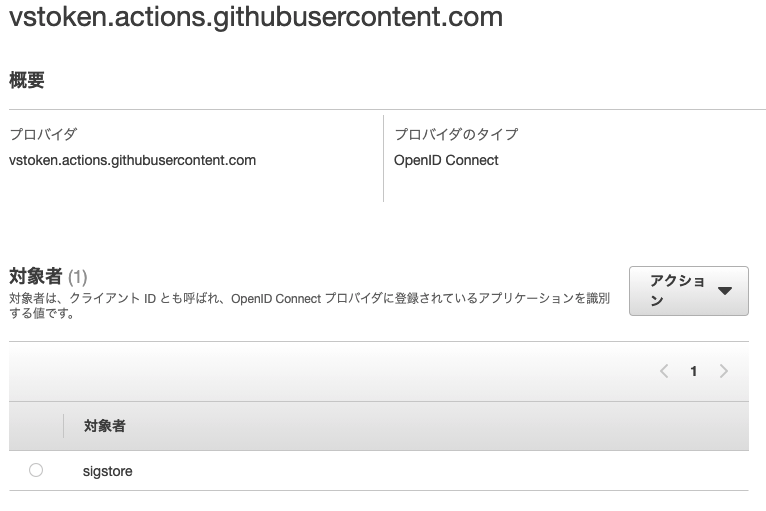
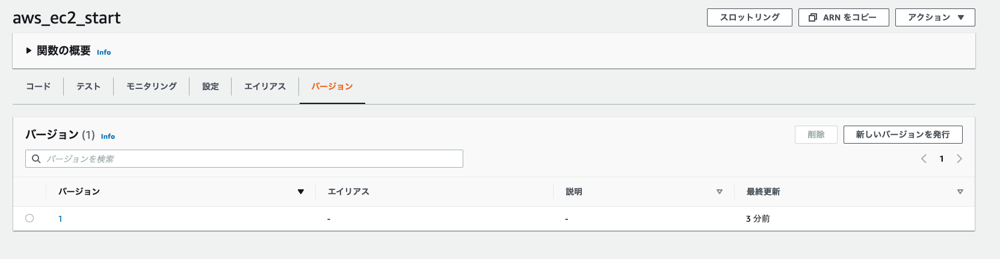

# 特定のタグ付きEC2を自動で開始する

## 仕組み

特定のタグ付けがなされたEC2インスタンスを起動する。

アプリケーションコードのデプロイには GitHubActionsを自動デプロイの設定を行う。


## 前準備

GithubActionsに永続的なクレデンシャルを渡さずにIAMロールでアクセス制御できるらしいので、早速テストしてみる

https://dev.classmethod.jp/articles/github-actions-without-permanent-credential/

### IAMポリシー


```json
{
  "Version": "2012-10-17",
    "Statement": [
      {
        "Effect": "Allow",
        "Action": [
          "s3:PutObject",
          "iam:ListRoles",
          "lambda:UpdateFunctionCode",
          "lambda:CreateFunction",
          "lambda:UpdateFunctionConfiguration"
        ],
        "Resource": "*"
      }
    ]
}
```

### IAM IDプロバイダー

OpenIDConnect を利用するための IDプロバイダを準備する。



- プロバイダ
  - vstoken.actions.githubusercontent.com
- プロバイダタイプ
  - OpenID Connect
- 対象者
  - sigstore

【参考】

AWS federation comes to github actions

- https://awsteele.com/blog/2021/09/15/aws-federation-comes-to-github-actions.html

OpenID Connectとは
- https://tech-lab.sios.jp/archives/8651
- https://qiita.com/TakahikoKawasaki/items/498ca08bbfcc341691fe

### IAMロール

- 信頼されたエンティティ
  - ↑で作成した IDプロバイダを選択
- ポリシー
  - ↑で作成したポリシーを選択

ここで ロールのARNを取得しておく

### Lambda関数を準備

今回は aws-cliの update-functionsでアップデートすることを想定しているため、一旦元となるlamdba関数を作成する。

- 関数の名前
  - aws_ec2_start

### Secretsを設定

ロールのARNをgithubのSecretsに登録しておく

```
ROLE_ARN=${先ほど取得したIAMロールのARN}
```

### actをインストールしておく

```bash
brew instal act
```

`act` コマンドを実行しながら、テストを行う

ちなみにM1 macを使っているなら以下のようにオプションを指定する非長がある。

https://dev.classmethod.jp/articles/act-for-github-actions-local-execution-tool/

## ユースケース

- 開発環境のEC2などを決まった時間に稼働する
  - 平日の深夜
  - 休日など

決まった時間に関してはAWS CloudWatchEventsで呼び出しを行う

`Reboot` のタグが `True` になっている特定のインスタンスのみ開始される

## デプロイの経過

こんな感じで githubの mainリポジトリにコードがプッシュされると・・・


Lanmda関数も更新されている！




## CloudWatchEventsの設定

今回はAWSコンソールを利用して手動で設定する。
Crone式で平日の決まった時間に起動するように設定する。
