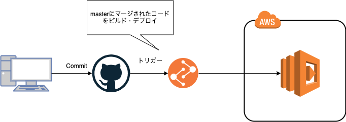

# 特定のタグ付きEC2を自動で開始する

## 仕組み

特定のタグ付けがなされたEC2インスタンスを起動する。

アプリケーションコードのデプロイには GitHubActionsを自動デプロイの設定を行う。



## 前準備

### IAMロールの準備

GithubActionsに永続的なクレデンシャルを渡さずにIAMロールでアクセス制御できるようになったので、早速テスト

https://dev.classmethod.jp/articles/github-actions-without-permanent-credential/


## ユースケース

- 開発環境のEC2などを決まった時間に稼働する
  - 平日の深夜
  - 休日など

決まった時間に関してはAWS CloudWatchEventsで呼び出しを行う

以下のように `Reboot` のタグが `True` になっている特定のインスタンスのみ開始される


## CloudWatchEventsの設定

今回はAWSコンソールを利用して手動で設定する。
Crone式で平日の決まった時間に起動するように設定する。


## デバッグ方法

`docker-compose-up` でコンテナを立ち上げる

app.pyの `lamdba-handler` 関数に実行したい処理を記載する

```py
# 例
def lambda_handler(event, context):
    return 'This is A Test'
```

この状態で以下のようにcurlコマンドを実行することで処理の実行を確認することができる

```
curl -XPOST "http://localhost:9000/2015-03-31/functions/function/invocations" -d '{}'
> "This is A Test" 
```
